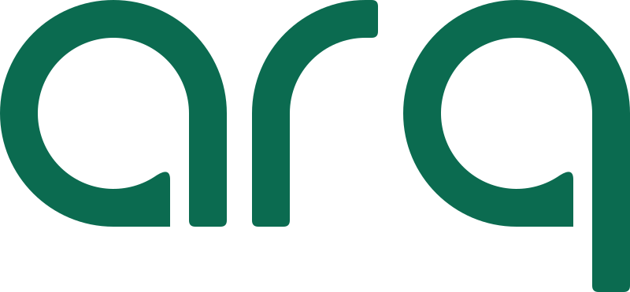
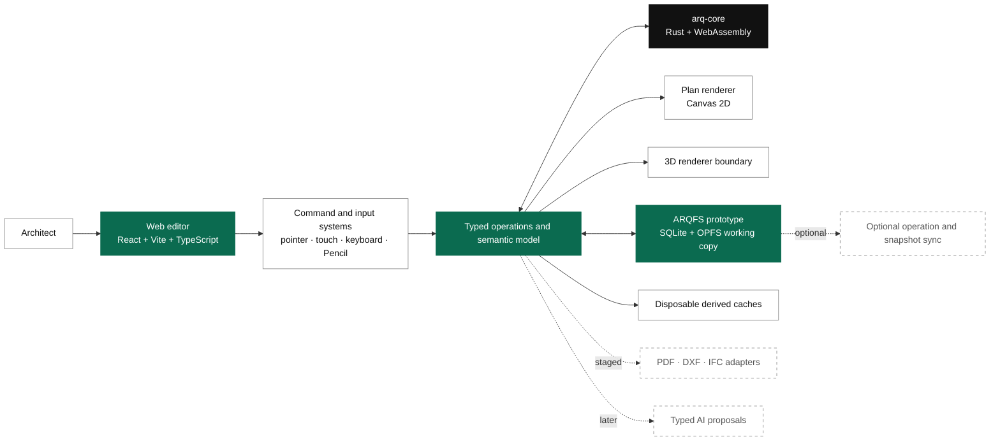
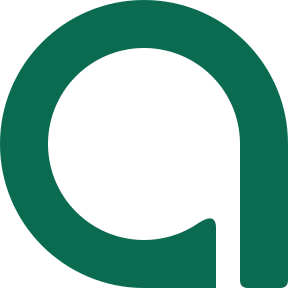

<h1 align="center">
  <picture>
    <source media="(prefers-color-scheme: dark)" srcset="brand/01_VECTOR/ARQ_Wordmark_White.svg">
    <source media="(prefers-color-scheme: light)" srcset="brand/01_VECTOR/ARQ_Wordmark_PhthaloGreen.svg">
    
  </picture>
</h1>

<p align="center"><strong>Architecture made simple.</strong></p>

<p align="center">
  Browser-first architectural authoring with visible BIM semantics, recoverable local project files, and dependable documentation.
</p>

<p align="center">
  <a href="#project-status"></a>
  <a href="#quick-start"></a>
  <a href="#architecture"></a>
  <a href="#licence"></a>
</p>

<p align="center">
  <a href="#overview">Overview</a> ·
  <a href="#project-status">Status</a> ·
  <a href="#quick-start">Quick start</a> ·
  <a href="#architecture">Architecture</a> ·
  <a href="#repository-map">Repository</a> ·
  <a href="#contributing">Contributing</a>
</p>

---

> [!WARNING]
> ARQ is pre-release software. This repository contains working application, core, storage, design-system, test, and benchmark code, but the protected end-to-end architectural workflow is not complete or ready for production projects.

## Overview

ARQ is a browser-based architectural plan and lightweight BIM editor for independent architects and small practices.

It combines direct CAD-style interaction with an inspectable semantic building model. Walls, openings, rooms, levels, dimensions, views, sheets, and their relationships are project data. Canvas primitives and 3D meshes are derived representations, not the source of truth.

<table>
  <tr>
    <td width="25%"><strong>Direct</strong><br><sub>Precise selection, snaps, numeric entry, and predictable editing.</sub></td>
    <td width="25%"><strong>Semantic</strong><br><sub>Plan, 3D, dimensions, and sheets refer to the same building objects.</sub></td>
    <td width="25%"><strong>Local-first</strong><br><sub>Ordinary authoring and recovery do not depend on a server round trip.</sub></td>
    <td width="25%"><strong>Explainable</strong><br><sub>Changes, failures, imports, and automation show their impact.</sub></td>
  </tr>
</table>

The protected first workflow is intentionally narrow:

```text
New project
    ↓
Dimensioned residential plan
    ↓
Coordinated 3D
    ↓
Scaled vector PDF
```

ARQ is not initially a replacement for every AutoCAD, Revit, Archicad, SketchUp, Rhino, or Blender workflow. The first objective is one complete residential authoring path that remains fast, inspectable, recoverable, and printable.

## Project status

The repository is in active technical validation and vertical-slice implementation.
The maintained area-by-area summary, gap list, and open decisions live in
[`STATUS.md`](STATUS.md).

| Area                  | Current repository state                                                                             |
| --------------------- | ---------------------------------------------------------------------------------------------------- |
| Browser editor        | Full workspace shell with an interactive plan canvas: wall drawing, snapping, selection, pan/zoom    |
| Design system         | Product shell components, design tokens, and a generated technical icon package                      |
| Domain boundaries     | Geometry, semantic model, operations, validation, rendering, storage, and adapter packages           |
| Shared core           | Rust crate with WebAssembly build and parity-check tooling                                           |
| Local project storage | Native SQLite and browser OPFS prototypes, single-writer protection, export, and recovery groundwork |
| Synchronisation       | Narrow operation and snapshot protocol groundwork, not a finished collaboration product              |
| Quality system        | Unit, property, browser, capability, performance, formatting, type, dependency, and licence checks   |
| Public website        | All seventeen public pages from `docs/pages/` as a static site with claim-honesty tests              |
| Product workflow      | Incomplete. The first wall-to-room-to-plan-to-3D-to-sheet workflow remains the release gate          |

### Current milestone

The active milestone is the first dependable architectural vertical slice:

1. create or trace a small plan;
2. create semantic walls and hosted openings;
3. derive rooms and coordinated plan output;
4. inspect the same objects in 3D;
5. add stable dimensions and a plan sheet;
6. export a clean scaled PDF;
7. close, recover, reopen, and verify the project.

### Deferred until the protected workflow is dependable

- broad DXF and IFC exchange;
- review, comments, issues, and multi-user collaboration;
- design options and semantic comparison;
- public AI authoring;
- native desktop and iPad applications;
- enterprise BIM, structural, MEP, fabrication, 4D, and 5D workflows.

## Product principles

1. **The semantic model is authoritative.** Renderer objects, canvas primitives, and caches are disposable projections.
2. **Every committed edit is explicit.** Operations carry preconditions, affected elements, invalidations, validation results, and inverse behaviour where meaningful.
3. **Invalid work fails safely.** A rejected operation must leave the previous project state unchanged.
4. **Recovery is local.** Acknowledged work and project access must not depend on cloud availability.
5. **Performance is product quality.** Selection, snapping, drawing, moving, opening, saving, and projection updates are measured as user actions.
6. **Interoperability reports fidelity.** Import and export must explain what was preserved, approximated, flattened, omitted, or retained as opaque data.
7. **Automation is reviewable.** AI may propose typed operations, but it cannot bypass deterministic validation or user approval.
8. **Complexity appears progressively.** ARQ should behave like a professional instrument, not an enterprise dashboard compressed into a drawing canvas.

## Architecture



### State boundaries

- **Interface state:** active tools, panels, hover, menus, temporary previews, and cameras
- **Canonical project state:** semantic entities, operations, views, sheets, annotations, resources, and revisions
- **Derived state:** meshes, room boundaries, projections, render lists, spatial indexes, validation results, and thumbnails
- **Adapters:** isolated exchange boundaries that cannot mutate canonical data directly
- **Cloud services:** optional metadata and collaboration services, not a requirement for ordinary local authoring

## Native `.arq` project format

The current ARQFS direction implements `.arq` as a native SQLite application database, not a renamed ZIP archive.

The canonical project is intended to contain semantic entities, typed operation history, views, sheets, annotations, resources, schema versions, migrations, and integrity metadata. Browser work uses an OPFS working copy with explicit writer ownership.

The implementation is being validated against these rules:

- local ownership and reopening without mandatory cloud access;
- transactional writes and deterministic migrations;
- backup or original-file retention before migration;
- recovery from an interrupted session;
- explicit schema and application versions;
- safe handling of unknown optional data;
- canonical project data that never depends on a cache;
- clean publication from a working copy to a portable `.arq` file.

Derived meshes, projections, indexes, and thumbnails may be cached for speed. Missing, stale, or corrupt derived data must trigger recomputation, not project failure.

## Quick start

### Requirements

- Node.js 20 or newer
- pnpm 9 through Corepack
- Rust toolchain for `arq-core` or WebAssembly work
- a current Chromium, Firefox, or Safari browser for browser validation

### Install and run the browser editor

```bash
corepack enable
pnpm install
pnpm --filter @arq/web dev
```

Build and preview the browser app:

```bash
pnpm --filter @arq/web build
pnpm --filter @arq/web preview
```

The current browser app renders the real ARQ shell and Canvas 2D pipeline with a small demo scene. It is not yet a complete project authoring workflow.

### Rust and WebAssembly

```bash
rustup target add wasm32-unknown-unknown
```

Install a `wasm-bindgen-cli` version compatible with the locked `wasm-bindgen` crate, then run:

```bash
pnpm rust:build-wasm
pnpm rust:verify-wasm-parity
```

## Development checks

Run the standard repository checks before opening a pull request:

```bash
pnpm format:check
pnpm lint
pnpm typecheck
pnpm test
pnpm build
```

Run the Rust checks when changing the shared core:

```bash
pnpm rust:fmt-check
pnpm rust:clippy
pnpm rust:test
```

Review dependency licences:

```bash
pnpm check:dependency-licences
```

<details>
<summary><strong>Capability and performance checks</strong></summary>

```bash
pnpm benchmark:canvas2d
pnpm benchmark:pixijs
pnpm benchmark:canvaskit
pnpm benchmark:render-frame
pnpm benchmark:pencil-input
pnpm benchmark:hover-sequence
pnpm benchmark:arqfs-opfs
pnpm benchmark:arqfs-writer-lock
pnpm benchmark:arq-core-worker
```

Benchmark results apply only to the tested commit, device, operating system, browser, project fixture, and measurement method. They are engineering evidence, not universal product claims.

</details>

## Repository map

```text
Arq/
├── apps/
│   ├── web/                  # Primary browser authoring surface
│   ├── marketing/            # Public website (static build of all PUB pages)
│   └── api/                  # Service boundary
├── packages/
│   ├── design-system/        # Product shell and shared interface components
│   ├── icons/                # Generated ARQ technical icon package
│   ├── editor-shell/         # Viewport and editor-shell contracts
│   ├── command-system/       # Command lifecycle and invocation
│   ├── input-system/         # Pointer, touch, keyboard, and Pencil abstractions
│   ├── geometry-2d/          # Plan geometry and spatial logic
│   ├── geometry-3d/          # 3D geometry boundary
│   ├── bim-core/             # Semantic building model
│   ├── operations/           # Typed project operations and undo groundwork
│   ├── plan-renderer/        # Canvas 2D plan rendering
│   ├── model-renderer/       # Coordinated 3D rendering boundary
│   ├── project-format/       # Native project-format contracts
│   ├── local-storage/        # Browser-local persistence
│   ├── validation/           # Deterministic validation
│   ├── pdf-export/           # Drawing and sheet export boundary
│   ├── dxf-adapter/          # DXF exchange boundary
│   └── ifc-adapter/          # IFC exchange boundary
├── workers/                  # Geometry and import/export workers
├── rust/
│   └── arq-core/             # Shared deterministic Rust core and WASM target
├── brand/                    # Canonical logo, favicon, app, social, and print assets
├── design/                   # Tokens and design resources
├── docs/                     # Product, ADR, architecture, UX, security, and research docs
├── benchmarks/                # Performance fixtures and results
├── scripts/                  # Build, benchmark, validation, and maintenance tools
├── prototype/                # Static product-shell prototype
└── .github/                  # Ownership, templates, workflows, and automation
```

See [`docs/architecture/REPOSITORY-STRUCTURE.md`](docs/architecture/REPOSITORY-STRUCTURE.md) for the package-level structure.

## Documentation and decisions

When sources disagree, use this order:

1. approved Architecture Decision Records in [`docs/adr/`](docs/adr/);
2. the active product blueprint, [`docs/product/ARQ-COMPLETE-PRODUCT-ENGINEERING-BLUEPRINT-v1.0.md`](docs/product/ARQ-COMPLETE-PRODUCT-ENGINEERING-BLUEPRINT-v1.0.md);
3. package, API, schema, page, component, and flow specifications;
4. machine-readable backlog, quality, and validation registers;
5. historical planning documents.

A material architecture change should be recorded through an ADR. Planning prose must not silently override accepted decisions, package contracts, tests, or working code.

## Brand system

This README uses the canonical ARQ wordmark from `brand/01_VECTOR/`. GitHub switches between the Phthalo Green and white variants based on the reader's colour scheme.

| Use                                             | Canonical location                                                                                       |
| ----------------------------------------------- | -------------------------------------------------------------------------------------------------------- |
| Brand guidelines                                | [`brand/00_GUIDE/ARQ_Brand_Guidelines_FINAL.pdf`](brand/00_GUIDE/ARQ_Brand_Guidelines_FINAL.pdf)         |
| Quick reference                                 | [`brand/00_GUIDE/ARQ_Logo_Quick_Reference_FINAL.pdf`](brand/00_GUIDE/ARQ_Logo_Quick_Reference_FINAL.pdf) |
| SVG wordmarks and symbols                       | [`brand/01_VECTOR/`](brand/01_VECTOR/)                                                                   |
| High-resolution transparent PNGs                | [`brand/02_4K_PNG/`](brand/02_4K_PNG/)                                                                   |
| Favicons, manifest, PWA icons, and social image | [`brand/03_WEB/`](brand/03_WEB/)                                                                         |
| App icon masters                                | [`brand/04_APP_ICONS/`](brand/04_APP_ICONS/)                                                             |
| Print-ready assets                              | [`brand/05_PRINT/`](brand/05_PRINT/)                                                                     |

Brand rules for implementation:

- use supplied assets without redrawing or retyping the wordmark;
- preserve the `q` descender and the required clear space;
- use vector artwork where possible;
- do not stretch, compress, rotate, outline, shadow, glow, or recolour the mark;
- use only ARQ Black `#000000`, ARQ White `#FFFFFF`, and ARQ Phthalo Green `#0B6B50` for the logo system;
- do not use the wordmark below 64 px, the symbol below 24 px, or the tagline lockup below 360 px;
- use the shared [`Logo`](packages/design-system/src/logo.tsx) component inside the product rather than importing logo files ad hoc.

## AI boundary

ARQ is not a chat interface that directly rewrites hidden geometry.

The intended AI contract is:

1. interpret a request against a known project revision;
2. produce a typed proposal;
3. show assumptions, affected objects, warnings, and document impact;
4. run deterministic validation;
5. require approval for consequential changes;
6. apply the accepted operation group;
7. preserve provenance and grouped undo.

AI output does not establish professional approval, building-code compliance, structural safety, fire safety, accessibility compliance, constructability, cost accuracy, or design correctness.

## Contributing

ARQ uses an ordered, backlog-driven contribution process. Coordinate work before starting, especially while architecture and file-format boundaries are still changing.

Before opening a pull request:

1. select an issue and confirm its phase, owner, dependencies, and acceptance criteria;
2. read the relevant ADR and package specification;
3. state the problem, proposed solution, and non-goals;
4. add tests and performance evidence where relevant;
5. record any new dependency and its licence;
6. document accessibility, project-format, migration, security, and rollback effects.

Read [`CONTRIBUTING.md`](CONTRIBUTING.md) and use the repository pull-request template.

## Security

Do not disclose an unpatched vulnerability through a public issue. Use the private reporting process described in [`SECURITY.md`](SECURITY.md).

Treat file import, migrations, project recovery, authentication, sharing, synchronisation, and future AI orchestration as security-sensitive boundaries.

## Professional-use boundary

ARQ is architectural authoring software under development. It does not certify professional approval, regulatory compliance, structural safety, fire safety, accessibility compliance, cost, or constructability. Qualified professionals remain responsible for project decisions and issued documents.

## Licence

Copyright © 2026 the ARQ project. All rights reserved.

This repository is proprietary. Source code, documentation, designs, schemas, and other materials may not be copied, modified, distributed, sublicensed, or sold without prior written permission. Third-party components remain governed by their own licences.

See [`LICENSE`](LICENSE) and [`NOTICE`](NOTICE) for the current terms and third-party notices.

---

<p align="center">
  <picture>
    <source media="(prefers-color-scheme: dark)" srcset="brand/01_VECTOR/ARQ_Symbol_White.svg">
    <source media="(prefers-color-scheme: light)" srcset="brand/01_VECTOR/ARQ_Symbol_PhthaloGreen.svg">
    
  </picture>
</p>

<p align="center"><sub>Direct while drawing. Structured while coordinating. Dependable while documenting.</sub></p>
