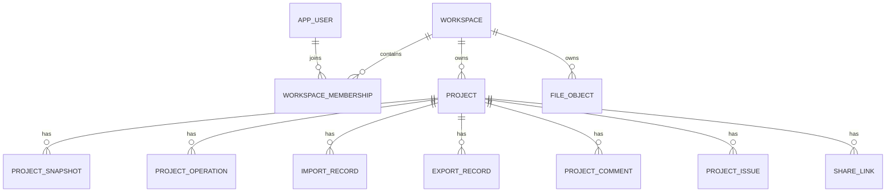

# Entity relationship draft

```mermaid
erDiagram
 APP_USER ||--o{ WORKSPACE_MEMBERSHIP : joins
 WORKSPACE ||--o{ WORKSPACE_MEMBERSHIP : contains
 WORKSPACE ||--o{ PROJECT : owns
 PROJECT ||--o{ PROJECT_SNAPSHOT : has
 PROJECT ||--o{ PROJECT_OPERATION : has
 PROJECT ||--o{ IMPORT_RECORD : has
 PROJECT ||--o{ EXPORT_RECORD : has
 PROJECT ||--o{ PROJECT_COMMENT : has
 PROJECT ||--o{ PROJECT_ISSUE : has
 PROJECT ||--o{ SHARE_LINK : has
 WORKSPACE ||--o{ FILE_OBJECT : owns
```
