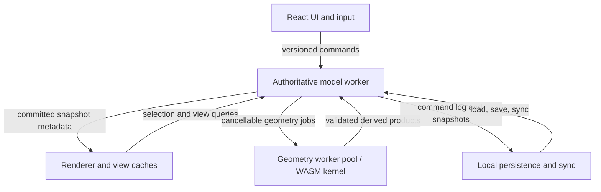
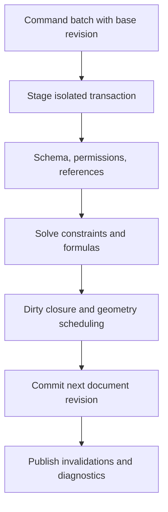

# Arq: Browser-Native CAD/BIM Engine Architecture

**Status:** implementation direction  
**Version:** 1.0  
**Date:** 24 July 2026  
**Audience:** Arq product, geometry, platform, rendering, and interoperability engineers

> The integrated top-level vision, UI/UX, collaboration, WebGPU, and rule-engine decisions are in [ARQ_MASTER_TECHNICAL_SPECIFICATION.md](ARQ_MASTER_TECHNICAL_SPECIFICATION.md). The consolidated product experience is in [ARQ_ULTIMATE_MASTER_SPECIFICATION.md](ARQ_ULTIMATE_MASTER_SPECIFICATION.md), and corrected selection, deferred-geometry, desktop-shell, and accessible UI guidance is in [ARQ_IMPLEMENTATION_DEEP_DIVE.md](ARQ_IMPLEMENTATION_DEEP_DIVE.md). This guide provides the detailed data, transaction, geometry, interoperability, and validation contract.

## 1. Executive decision

Arq should be built as a **semantic parametric building model with derived geometry**, not as a WebGL scene that happens to contain walls.

The canonical document owns:

- stable element identity and versioning
- units, coordinate frames, tolerance policy, and georeferencing
- BIM semantics such as levels, wall types, openings, materials, classifications, properties, and relations
- parameters, feature definitions, constraints, and formulas
- authoritative geometric intent in double precision
- command history and transaction revisions

Everything else is derived and replaceable:

- B-Rep handles and topology produced by a kernel
- tessellated meshes
- Three.js, WebGL, or WebGPU objects
- render batches, GPU buffers, selection IDs, spatial indexes, and thumbnails
- import-time caches and analysis results

This distinction is the foundation for reliable undo, editing, file interchange, collaboration, migration, and deterministic rendering.

### The recommended first product boundary

Build Arq first as a **2D/2.5D architectural modeller**:

1. semantic levels, grids, walls, slabs, columns, doors, windows, rooms, dimensions, and annotations
2. strong plan editing, snapping, direct manipulation, undo/redo, and deterministic generated 3D
3. host openings, joins, sections, elevation views, and a practical IFC subset
4. isolated B-Rep operations for the cases that genuinely need them

Do not begin by attempting a general-purpose NURBS modeller, full IFC 4.3 round-tripping, universal DWG support, or arbitrary CAD booleans. Those are separate programmes with very different reliability and licensing costs.

### The core implementation rule

> The renderer may be wrong temporarily. The model may not be wrong permanently.

If a tessellation or GPU buffer is stale, discard and regenerate it. If an edit would leave a semantic, topological, or transactional inconsistency, reject the transaction and preserve the last committed document revision.

## 2. Scope, non-goals, and language

### In scope

- browser-native authoring with TypeScript, Workers, WebAssembly where justified, WebGL2 baseline, and WebGPU enhancement
- float64 CPU-side data and calculations
- deterministic semantic modelling for architectural elements
- high-quality 2D/3D interactive editing at building scale
- bounded, observable background geometry work
- scoped IFC, DXF, and geometry interchange

### Explicit non-goals for the first production release

- a promise of exact mathematical arithmetic or unlimited precision
- a complete replacement for AutoCAD, Revit, or a mechanical CAD system
- unconstrained freeform surface modelling
- full-fidelity import/export of every DWG, IFC, STEP, or Revit feature
- exact screen picks based only on GPU triangle data
- mandatory cross-origin isolation or mandatory worker-rendered canvas

### Important terminology

| Term                      | Meaning in this document                                                                                                 |
| ------------------------- | ------------------------------------------------------------------------------------------------------------------------ |
| **Semantic model**        | Persistent BIM/domain data such as a wall's type, base level, offsets, host, materials, and properties                   |
| **Geometric intent**      | Parametric definitions, sketches, curves, profiles, placements, and feature inputs that produce shape                    |
| **B-Rep**                 | Boundary representation: topology plus supporting curves and surfaces, usually with tolerance-aware numerical operations |
| **Render mesh**           | A disposable polygonal approximation used by the GPU                                                                     |
| **Derivation dependency** | A directed dependency used to schedule recomputation                                                                     |
| **Constraint group**      | An algebraic relationship that may be bidirectional and is solved, not topologically sorted                              |
| **Document revision**     | A monotonically increasing committed version of a model document                                                         |

## 3. Corrections to the supplied technical premise

The supplied draft has the right instinct: do not make a triangle mesh the CAD source of truth. Several statements need tightening before they turn into implementation bugs.

1. **B-Rep is not infinite precision.** Analytic primitives represent intent compactly, but floating-point storage, intersections, trimming, and Boolean kernels still use finite tolerances and numerical algorithms.
2. **B-Rep is not BIM.** A boundary model does not preserve a wall's level, type, phases, fire rating, host relation, property sets, or IFC identity. Those must live above geometry.
3. **Not every relationship forms a DAG.** Host and derivation dependencies can be directed. Equal-distance, alignment, and dimension constraints can form cyclic systems and need a constraint solver with diagnostics.
4. **The example dependency graph only evaluates explicitly dirty nodes.** It misses downstream dependants, ignores missing dependencies, and cannot provide a useful cycle path. The corrected reference implementation handles the dirty closure.
5. **The example snap engine is not an R-tree.** It stores a Map and checks one segment. It also labels a world-space distance as pixels, lacks intersections, and returns the first endpoint instead of globally ranking candidates.
6. **A single mesh Boolean preview can disagree with an eventual B-Rep result.** For architectural elements, preview the same declarative feature inputs when possible. If a provisional mesh result is shown, label it provisional and never make it canonical.
7. **ArrayBuffer transfer and shared memory are different.** A transferred ArrayBuffer commonly moves ownership and detaches the sender. SharedArrayBuffer is shared memory and needs cross-origin isolation. Neither is automatically the right default.
8. **The supplied high/low shader is incomplete.** It must use one coordinate convention end-to-end and must not subtract the camera twice through a translated model-view matrix.
9. **The float32 spacing at 1,000,000 metres is 0.0625 m, not exactly 0.1 m.** The practical lesson remains: world-scale float32 coordinates are unsuitable for fine building editing.
10. **DWG is not just another parser target.** Autodesk positions RealDWG as the toolkit for read/write support. Treat browser-native DWG support as a separate licensed product decision, not a line item after IFC.

The companion audit records the detail and the implementation impact of each correction.

## 4. Architectural principles

### 4.1 Four independent layers of truth

Keep the following layers separate. They evolve at different rates and have different validity rules.

| Layer                | Stores                                                                        | Must be persistent?                           | Validated by                               |
| -------------------- | ----------------------------------------------------------------------------- | --------------------------------------------- | ------------------------------------------ |
| Semantic document    | Elements, types, properties, relations, placements, formulas, command history | Yes                                           | Schema, domain, and referential validation |
| Geometric derivation | Profiles, curves, solids, B-Rep products, tessellation keys                   | Source definitions yes; generated products no | Kernel and topology validation             |
| Spatial acceleration | R-trees, BVHs, snap primitive indexes, room-boundary indexes                  | No                                            | Rebuild/incremental index validation       |
| Presentation         | Scene graph, GPU resources, lines, labels, selection glow, camera             | No                                            | Render and visual regression tests         |

Never persist a GPU ID, a native kernel pointer, a Three.js object reference, or a screen-space coordinate as the only representation of a model fact.

### 4.2 Stable identity over incidental identity

Every user-visible element needs a stable document-owned ID. A regenerated wall must preserve its element ID even if it receives a different kernel shape handle, tessellation, mesh index, or R-tree leaf.

Use separate identities for:

- element ID
- type ID
- relationship ID where the relationship has properties
- command ID and transaction ID
- imported source ID and source revision
- derived geometry revision and render-cache key

Avoid using array positions, object pointers, kernel handles, or renderer object UUIDs as persistent IDs.

### 4.3 Immutable committed snapshots, mutable transaction staging

The model worker should expose immutable committed snapshots by revision. A transaction works against an isolated mutable staging state, validates it, then atomically publishes the next revision.

This gives the renderer a coherent snapshot while expensive geometry work proceeds, and it prevents half-applied edits when a Boolean, import, or constraint solve fails.

### 4.4 The model worker is authoritative

One dedicated model worker owns document mutations and revision assignment. The UI sends typed commands. It does not directly mutate a shared JavaScript object holding the model.

Heavy geometry work can run in a bounded worker pool, but its result is only accepted when:

- the originating document revision still matches
- the job's input signature still matches
- validation succeeds
- the transaction or follow-up recompute has not been cancelled

## 5. System topology



### 5.1 Main thread responsibilities

- pointer, keyboard, accessibility, panel, and layout handling
- temporary direct-manipulation preview that cannot mutate the document
- render scheduling and view-specific cache ownership
- typed worker bridge and stale-result rejection at the presentation boundary
- user feedback for pending, failed, or rejected operations

### 5.2 Authoritative model worker responsibilities

- schema migration and document validation
- command execution, transactions, undo/redo, and revision assignment
- dependency scheduling and constraint coordination
- semantic relation management
- spatial index ownership and query answers
- dispatch and validation of geometry jobs
- durable autosave scheduling

### 5.3 Geometry worker pool responsibilities

- B-Rep construction, Boolean operations, healing, tessellation, slicing, and import parsing
- cancellation checks between meaningful kernel phases
- memory limits and job admission control
- structured diagnostics, never unhandled native exceptions

### 5.4 Renderer responsibilities

- create drawables from a committed revision plus per-view cache
- choose level of detail and local render origin
- draw selection, guides, dimension text, and snap feedback
- use GPU ID picking as an acceleration, not as the only source of semantic selection
- discard buffers when their geometry revision or origin key changes

## 6. Canonical semantic data model

### 6.1 Document root

The document root should contain the policies that make the file interpretable anywhere:

```typescript
interface ArqDocument {
  schemaVersion: number;
  documentId: string;
  revision: number;
  units: UnitPolicy;
  tolerances: TolerancePolicy;
  coordinateSystem: CoordinateSystemPolicy;
  elements: Record<string, ElementRecord>;
  relationships: Record<string, RelationshipRecord>;
  types: Record<string, TypeRecord>;
  propertySets: Record<string, PropertySetRecord>;
  commandLog: CommandEnvelope[];
}
```

Use metres and radians internally. Store the chosen display units and rounding policy separately. Do not use formatted strings such as "3000 mm" as numeric truth.

### 6.2 Element model

Every element has a common envelope plus a strongly typed payload. The payload owns modelling intent, not the derived mesh.

```typescript
interface ElementBase {
  id: string;
  kind: ElementKind;
  name?: string;
  placement: LocalPlacement;
  typeId?: string;
  propertySetIds: string[];
  createdAtRevision: number;
  updatedAtRevision: number;
  source?: ImportProvenance;
}

interface WallElement extends ElementBase {
  kind: 'wall';
  path: Curve2DOr3D;
  baseLevelId: string;
  baseOffset: number;
  topConstraint: TopConstraint;
  unconnectedHeight?: number;
  wallTypeId: string;
  locationLine: WallLocationLine;
  joinPolicy: WallJoinPolicy;
}
```

A wall's openings belong in explicit host relationships or feature records. Do not encode door holes as an irreversible mutation to a wall mesh.

### 6.3 Relations are first-class

Examples:

- hosts: wall -> window
- belongs to: level -> building
- has type: occurrence -> type
- aggregates: building -> storey
- joins: wall <-> wall
- references: dimension -> geometry reference
- maps to source: Arq element -> IFC GlobalId

Store relation kind, endpoints, metadata, creation revision, and optional source provenance. Some relationships are naturally cyclic. That is acceptable in the semantic graph.

### 6.4 Type/occurrence separation

Use a reusable type record for shared wall-layer definitions, door families, materials, and classification data. An occurrence holds the local placement and overrides. This improves file size, consistency, and IFC mapping.

### 6.5 Formula safety

Formula inputs must be an AST or a restricted expression language. Never evaluate arbitrary JavaScript from a project file. Resolve referenced parameters through a controlled dependency service and return precise diagnostics for cycles, missing variables, unit mismatch, divide-by-zero, and invalid domains.

### 6.6 Schema evolution

Every persisted document needs:

- a schema version
- deterministic migrations from supported previous versions
- a loss-aware fallback for unknown future fields
- a migration test fixture for every released schema
- a way to preserve imported unknown IFC/DXF metadata without pretending to edit it correctly

## 7. Geometry strategy: semantic intent, robust products, disposable meshes

### 7.1 Representation hierarchy

Arq should retain the highest useful representation of intent:

1. semantic element and parameters
2. sketch, profile, curve, placement, and feature definitions
3. kernel-owned B-Rep or procedural solid product when required
4. tessellated render mesh and 2D view primitives

The lower representations can be recreated from the higher ones. The reverse is generally lossy.

### 7.2 Where B-Rep belongs

B-Rep is valuable for:

- precise trimmed faces and analytic surfaces
- non-trivial cuts, intersections, offsets, fillets, and export
- section geometry and manufacturing-like detail
- high-fidelity STEP or B-Rep exchange

It is not necessary for every first-generation building element. A straight wall with rectangular openings can be generated reliably from semantic profiles and local feature cuts before full arbitrary B-Rep support is introduced.

### 7.3 Boolean rules

Treat every Boolean as a potentially failing, tolerance-sensitive operation.

Each Boolean request must have:

- input element IDs and geometry revisions
- requested operation and tolerance context
- cancellation token and time/memory budget
- result status: success, invalid input, cancelled, timeout, kernel failure, or healing required
- topology validation and detailed diagnostics
- atomic acceptance or rejection

Never silently replace a failed Boolean with a damaged mesh. Preserve the prior committed shape and show a recoverable diagnostic to the user.

### 7.4 Topology preservation

If a geometry kernel exposes B-Rep topology, retain a mapping from generated topology to semantic feature and source element where practical. Topology names are often unstable after booleans, so mappings must be revision-scoped and treated as best-effort. Persistent user references should prefer semantic references, stable generated references, or explicit reattachment workflows.

### 7.5 Tessellation

Tessellation must be keyed by:

- geometry content signature
- tolerance or screen-error policy
- render origin / chunk ID
- view mode and material/edge requirements
- kernel and schema version where relevant

Tessellation is not one global fixed mesh. A plan view, a distant perspective, a close detail, and an export may require different error policies.

## 8. Coordinate systems, units, and precision

### 8.1 Use a frame hierarchy

Maintain explicit transformations:

```text
Georeference frame
  -> project frame
    -> building frame
      -> level / storey frame
        -> element local frame
          -> profile / feature frame
```

The semantic document should preserve the georeference separately from working building coordinates. Most building edits happen near a stable project-local origin. Geographic Easting/Northing values should not flow through every wall vertex.

### 8.2 Float64 on CPU, float32 after localising on GPU

JavaScript Number and WebAssembly f64 are suitable for the canonical CPU model. GPU vertex inputs normally use float32, so subtract a carefully selected render origin in float64 before converting positions to Float32Array.

| Magnitude in metres | Nearest float32 spacing | Consequence              |
| ------------------- | ----------------------: | ------------------------ |
| 1                   |       about 0.000000119 | Fine for local rendering |
| 10,000              |       about 0.000976563 | Around 1 mm increments   |
| 1,000,000           |                  0.0625 | About 6.25 cm increments |

Spacing is not the whole error story, but it explains why city-scale coordinates must be localised before rendering.

### 8.3 Render-origin policy

Use the smallest stable local frame that covers the active view:

- normal building editing: building or level origin
- large sites: per-tile or per-building origin
- high-detail view: local chunk origin near the visible work
- geospatial overview: dedicated overview mode with its own coarser error budget

Changing the render origin invalidates render buffers, not document geometry. Origin changes must not create undo entries or modify saved model coordinates.

### 8.4 Relative-to-eye is an escalation path

High/low coordinate splitting can help when normal localisation cannot keep values small enough. It does not add true float64 arithmetic to WebGL. Use it only after measuring a real precision problem, request high precision shader qualifiers where available, and keep the local view matrix free from a second incompatible translation.

The companion coordinate reference shows a safe CPU-side split and localisation contract.

### 8.5 Tolerance policy is document data

Do not scatter magic epsilon constants through snapping, joins, imports, and booleans. Store a named tolerance policy with:

- absolute geometric tolerance
- angular tolerance
- relative comparison tolerance
- merge / healing tolerance
- display rounding tolerance
- import tolerance

The policy must be versioned, surfaced in diagnostics, and tested against project units. A tolerance suitable for a metre-based building model is not automatically suitable for a millimetre mechanical model.

## 9. Dependencies, formulas, and constraints

### 9.1 Do not use one graph for everything

Arq needs four distinct graph-like structures:

| Structure                 | Can have cycles?           | Purpose                                                    | Evaluation rule                           |
| ------------------------- | -------------------------- | ---------------------------------------------------------- | ----------------------------------------- |
| Semantic relation graph   | Yes                        | Host, containment, joins, type assignment, references      | Referential validation                    |
| Directed derivation graph | No                         | Parameter or geometry outputs derived from inputs          | Dirty closure plus topological evaluation |
| Constraint graph          | Yes                        | Dimensions, alignment, equality, and geometric constraints | Numerical or symbolic solve group         |
| B-Rep topology graph      | Yes in the adjacency sense | Vertices, edges, coedges, loops, faces, shells             | Kernel-owned topology validation          |

The original draft treats all spatial relations as a DAG. That would reject valid modelling relationships or hide solver failures behind a simplistic sort.

### 9.2 Directed derivation graph

Use a DAG for values that truly have a direction:

- level elevation -> wall base and top
- wall path plus type -> generated wall product
- host wall product plus opening definition -> opening cut product
- type layer definition -> occurrence material assignment
- parameter AST references -> formula result

On a mutation:

1. identify the directly changed node or nodes
2. traverse reverse edges to compute the full downstream dirty closure
3. topologically sort only the affected subgraph
4. evaluate each node exactly once in stable order
5. collect errors without publishing partial derived products
6. publish the next derived cache revision after all required validation succeeds

The reference dependency graph implements this closure. It also rejects missing dependencies, duplicate IDs, and cycles with a human-readable cycle path.

### 9.3 Constraint groups

Constraints such as parallel, coincident, equal, fixed distance, and aligned may be cyclic by design. Put them in an explicit solve group with:

- variables and their unit dimensions
- constraints and priority or strength
- driving versus driven dimensions
- solver tolerance and iteration limit
- conflict / over-constraint diagnostic
- under-constrained degree-of-freedom diagnostic
- last valid solution used for preview fallback

Do not convert a failed constraint solve into silently moved geometry. Preserve the last committed values and show which constraints conflict.

### 9.4 Formula and dependency cycles

Formula cycles are usually errors. Constraint cycles are not necessarily errors. Keep these diagnostics separate so that a user sees either:

- "Parameter A depends on B, B on C, and C on A", or
- "This sketch is over-constrained by these dimensions"

Those are different failures with different remedies.

## 10. Transaction, history, and recompute pipeline

### 10.1 Commands are the mutation API

Every user edit, import merge, script action, and remote collaboration operation must become a typed command. Examples:

- CreateElement
- DeleteElement
- SetParameter
- MovePlacement
- ChangeType
- AttachHost
- DetachHost
- AddConstraint
- RemoveConstraint
- ApplyImportMapping
- ResolveConflict

The UI can draw a provisional drag preview, but the committed model changes only when the model worker accepts a command transaction.

### 10.2 Commit lifecycle



If any required step fails, discard the staged mutation. A long-running geometry job may complete after commit only when the document can safely render an approved provisional product; otherwise the command waits or is rejected according to product semantics.

### 10.3 Base revision and stale result rules

Every request includes:

- protocol version
- document ID
- request ID
- transaction ID where applicable
- base document revision
- input content signature for generated products

The worker rejects a mutation against an incompatible base revision. A geometry result is discarded when its input signature or revision no longer matches the live document. This is mandatory for fast dragging, undo, import cancellation, and collaboration.

### 10.4 Undo and redo

Undo should operate on semantic commands or validated inverse patches, not screen state and not raw vertex arrays.

Rules:

- undo restores a new committed revision; revisions never go backwards
- derived mesh caches are regenerated, never stored in undo payloads
- a grouped drag becomes one user-facing undo item
- failed or cancelled transactions create no undo item
- imported or remote operations carry enough provenance to produce an intelligible undo description
- an inverse is validated against the current model; if collaboration made it unsafe, create a conflict rather than corrupting the document

### 10.5 Direct manipulation

For pointer drag:

1. use the current committed snapshot for snapping and hit testing
2. compute a local preview transform or parameter override
3. draw the preview without mutating canonical geometry
4. coalesce pointer updates locally
5. submit one final semantic command on pointer release, or sampled intentional checkpoints for long drags
6. animate or reconcile to the committed result

This keeps the UI responsive even when an exact recompute is expensive.

## 11. Spatial indexing, selection, and snapping

### 11.1 Separate the three jobs

| Job                             | Preferred mechanism                                   | Truth source                                |
| ------------------------------- | ----------------------------------------------------- | ------------------------------------------- |
| Coarse visible-object selection | GPU ID buffer or broad-phase CPU query                | Semantic element ID                         |
| Precise semantic hit test       | CPU spatial index plus analytic / kernel narrow phase | Geometric intent or kernel product          |
| Object snap                     | Active work plane plus plan/curve primitive index     | Exact or tolerance-aware curve calculations |

GPU triangle picking is useful, but it cannot replace analytic snapping or semantic references. A door opening, edge, wall centreline, or level reference may not exist as a stable render triangle.

### 11.2 Index hierarchy

Maintain indexes by document revision:

- **element R-tree:** 2D plan bounding boxes for semantic elements
- **primitive R-tree:** snap primitives such as endpoints, arcs, profile edges, and wall axes
- **3D BVH:** view-specific tessellated mesh acceleration for visible-object ray tests
- **room / topology index:** semantic adjacency and boundary lookups
- **text / annotation index:** label collision and selection support

Use an incremental index update when a bounded number of elements changes. Fall back to a rebuild after large imports or systemic parameter changes. Validate that an index's revision matches the snapshot it answers.

### 11.3 Screen-space tolerance converted into model space

The user defines a visual tolerance, such as a number of screen pixels. Do not hard-code a world-space snap radius.

For a plan view:

1. unproject the cursor and an offset pixel through the active camera into the active work plane
2. derive local world-units-per-pixel
3. query the R-tree with the resulting model-space tolerance box
4. perform narrow-phase curve math
5. convert candidate distances back to pixels for ranking and feedback

For a perspective or 3D view, use the ray, active work plane, depth policy, and view direction explicitly. A 3D cursor without a working plane is ambiguous.

### 11.4 Candidate generation and ranking

Generate all viable candidates in the bounded query set before choosing one. Default precedence should be user-configurable. A sensible starting order is:

1. endpoint
2. intersection
3. midpoint or centre
4. perpendicular or tangent
5. nearest point
6. extension, polar, grid, and tracking guides

Then rank by:

- explicit priority
- pixel distance
- active work plane compatibility
- current command compatibility
- layer / visibility / lock state
- stable deterministic tie-break key

Do not return on the first endpoint seen. That makes snapping depend on R-tree traversal order and creates visibly unstable cursor behaviour.

### 11.5 Robust narrow phase

Production narrow-phase math needs:

- 2D robust orientation and intersection predicates for plan operations
- segment, arc, ellipse, spline, and polycurve support
- explicit near-parallel and near-tangent classification
- tolerance-aware duplicate merging
- separate handling of true 3D skew lines versus 2D projected intersections
- test fixtures at both tiny and huge coordinate magnitudes

The reference snap engine intentionally focuses on a safe 2D segment contract. It accepts a real spatial index interface rather than pretending a Map is an R-tree.

### 11.6 Snap feedback

Snap feedback is presentation state:

- glyph type and position
- temporary anchor
- guide lines and extension rays
- tooltip / command prompt
- optional vibration only where platform support and user settings allow it

It is never persisted as model geometry.

## 12. Rendering and view system

### 12.1 Rendering boundary

WebGL2 is the compatibility baseline. WebGPU can improve batching, compute, and buffer management where available, but Arq's semantic and geometry engine must not depend on a single graphics API.

Three.js or another renderer can be productive as a presentation abstraction. Keep it behind a renderer adapter. The adapter receives immutable render packets with local-origin positions, styles, element IDs, and revision keys.

### 12.2 View kinds

Treat these as different consumers of the same model, not separate documents:

- plan
- reflected ceiling plan
- elevation
- section
- detail
- 3D perspective
- 3D orthographic
- schedule / property view

Each has explicit view settings, visibility filters, cut-plane logic, scale, annotation scale, and render-origin strategy.

### 12.3 Sectioning and plan cuts

A shader clipping plane is valid for fast visual preview. It does not produce authoritative section topology, hatch boundaries, dimensions, or export geometry.

For authoritative 2D views, derive section curves from semantic/procedural geometry or invoke a validated kernel slice operation. Cache the result by geometry revision, view cut definition, and tolerance.

### 12.4 Lines, edges, text, and depth

CAD quality requires more than triangles:

- screen-space constant-width line rendering
- clear hidden-line and cut-edge policy
- depth-safe overlays and labels
- text shaping and font fallback
- selection / hover without changing semantic appearance
- dynamic near/far range and appropriate depth strategy
- graceful degradation for limited GPU precision

Do not claim a fixed 60 FPS in all project sizes. Measure real frame budgets by device class and degrade quality, level of detail, shadows, and overlays in a controlled order.

### 12.5 GPU picking safeguards

An ID buffer can accelerate selection. It needs:

- a stable mapping from transient draw ID to semantic element ID for the exact render revision
- a fallback CPU query for hidden, thin, or not-yet-rendered geometry
- pointer-move throttling and pointer-up confirmation to avoid readback stalls
- correct handling of instancing, clipping, transparency, and multi-viewports

Never store the draw ID in the persistent document.

## 13. Browser workers, WASM, and data transfer

### 13.1 Worker topology

Use:

- one serial model worker per open document
- a small bounded pool for CPU-heavy geometry, import, and tessellation jobs
- optional render worker only after it demonstrably improves target browsers and devices

More workers are not automatically faster. Geometry kernels can consume substantial memory, and a browser tab must coexist with the rest of the application.

### 13.2 Versioned protocol

Define a discriminated union for all request and result messages. It must carry the revision context and no functions, DOM nodes, or native kernel handles. See the reference worker protocol.

Important result categories:

- committed transaction
- validation rejection
- progress update
- cancellable job acknowledgement
- derived render packet
- stale or cancelled result
- structured kernel / import diagnostic

The protocol is a public internal API. Version it and test it with fixtures.

### 13.3 Transferable ArrayBuffer versus SharedArrayBuffer

| Mechanism                | Use when                                                  | Important constraint                                                             |
| ------------------------ | --------------------------------------------------------- | -------------------------------------------------------------------------------- |
| Structured clone         | Payloads are small or infrequent                          | Copies ordinary objects                                                          |
| Transferable ArrayBuffer | One producer hands a finished mesh packet to one consumer | Sender loses use of the transferred buffer                                       |
| SharedArrayBuffer        | A measured hot path needs concurrent shared memory        | Requires secure, cross-origin-isolated deployment and careful Atomics discipline |

ArrayBuffer transfer is often the simpler fast path for render packets. Shared memory must have a normal transfer fallback. Cross-origin isolation can affect external scripts, images, iframes, analytics, and other embeds, so treat it as a deployment architecture decision.

### 13.4 OffscreenCanvas

OffscreenCanvas can move rendering work to a worker in supported configurations. It should be feature-detected and optional:

- never call getContext on the HTML canvas before transferring it
- retain an on-main-thread renderer path
- measure input latency, memory, and browser support before making it default
- keep model mutation separate from render worker lifetime

### 13.5 WebAssembly boundaries

WASM is appropriate for a proven geometry kernel, robust predicates, parsing, and computational hot spots. It does not erase cancellation, memory, licensing, or browser interoperability concerns.

Use a narrow adapter boundary:

```typescript
interface GeometryKernel {
  build(request: BuildRequest): Promise<KernelResult>;
  boolean(request: BooleanRequest): Promise<KernelResult>;
  tessellate(request: TessellationRequest): Promise<MeshPacket>;
  slice(request: SliceRequest): Promise<SectionPacket>;
  validate(request: ValidationRequest): Promise<ValidationReport>;
  dispose(handle: GeometryHandle): Promise<void>;
}
```

No other part of the application should depend on Open CASCADE, Manifold, or a future kernel's native object model.

## 14. Geometry-kernel decision

### 14.1 What a kernel does and does not decide

A geometry kernel can provide B-Rep construction, validation, Boolean operations, healing, sectioning, tessellation, and file geometry translation. It does not decide:

- BIM schema
- transaction and undo semantics
- wall-host behaviour
- unit policy
- collaboration conflict rules
- rendering architecture
- import mapping policy

Arq should own those decisions.

### 14.2 Current candidate fit

| Candidate                            | Best fit                                                              | Benefits                         | Material caveat                                                                                        |
| ------------------------------------ | --------------------------------------------------------------------- | -------------------------------- | ------------------------------------------------------------------------------------------------------ |
| Open CASCADE Technology              | Advanced B-Rep, STEP, analytic surfaces, serious geometry interchange | Mature broad B-Rep capability    | WASM build, memory, tolerance handling, and LGPL 2.1 plus exception obligations need deliberate review |
| Manifold                             | Fast, reliable manifold triangle-mesh CSG                             | Small, practical mesh operations | It is mesh-based, not an analytic B-Rep or NURBS kernel                                                |
| CGAL                                 | Selected rigorous computational geometry algorithms                   | Rich algorithms and predicates   | Components are GPL/LGPL or commercial; audit each component before use                                 |
| Truck or another Rust geometry stack | Experimental web-oriented evaluation                                  | Native Rust/WASM ergonomics      | Ecosystem maturity and file interchange coverage must be proven with Arq fixtures                      |

Licensing must be reviewed against the exact version, build method, distribution model, and modifications before code is shipped. Do not infer compliance from a table.

### 14.3 Recommended kernel posture

1. Ship the initial wall/slab/opening system through semantic procedural builders and robust 2D profile operations.
2. Define the GeometryKernel adapter before choosing a concrete kernel.
3. Run the benchmark and failure corpus in the kernel evaluation plan.
4. Introduce a B-Rep kernel for advanced features and interchange only after it passes target project and device criteria.
5. Keep mesh-only operations explicitly mesh-only. Do not present their output as a lossless B-Rep edit.

### 14.4 Preview policy

For common architectural edits, the fastest preview is usually generated from the same parameters that will produce the committed model. For an operation that truly requires expensive kernel work:

- render the last valid product plus a translucent declarative preview
- show pending / failed state honestly
- allow cancellation on subsequent user input
- never commit a different mesh approximation without validation

## 15. Interoperability and file-format strategy

### 15.1 IFC is semantic, not merely geometric

IFC is an open built-asset data standard with schema, property/quantity definitions, and serialisation mechanisms. A faithful IFC implementation must consider identity, placements, containment, relationships, types, materials, units, property sets, and geometry.

Start with a declared subset. A practical initial target can cover:

- project, site, building, and storey hierarchy
- local placements and units
- walls, slabs, columns, doors, windows, and openings
- common type assignments and material layers
- selected property sets and classifications
- native element IDs mapped to IFC GlobalId
- representation items that Arq explicitly supports

Unsupported entities should be:

- recorded with their IFC class and source ID
- preserved as opaque metadata where legally and technically safe
- surfaced as import diagnostics
- excluded from an "edited with full fidelity" claim

### 15.2 IFC import pipeline

1. Parse in a cancellable worker with file-size and recursion limits.
2. Validate schema and source units before semantic mapping.
3. Establish a project-local coordinate frame and retain the original georeference.
4. Map supported source entities to native semantic elements.
5. Preserve provenance and mapping decisions.
6. Build geometry asynchronously and validate outputs.
7. Review unresolved entities, unsupported attributes, and repair actions.
8. Commit the import as a transaction or isolated import branch.

An IFC import is not successful merely because triangles appear on screen.

### 15.3 IFC export rules

Export only the native semantics Arq can state truthfully. Preserve stable source IDs only when that is valid for the workflow. Generate a validation report with:

- exported entity count by class
- omitted or downgraded data
- unit and coordinate transform
- geometry validation status
- schema and exporter version

Maintain golden import/export fixtures. Test semantic round-trip separately from rendered appearance.

### 15.4 DXF and DWG

DXF is suitable for a narrow 2D interchange scope:

- layers, line types, blocks, polylines, arcs, circles, text, dimensions, and basic hatches only after explicit support is implemented
- explicit coordinate and unit conversion
- no silent conversion of unsupported dynamic blocks, custom entities, or annotation behaviours

DWG requires a separate strategy. Autodesk documents RealDWG as the C++/.NET toolkit for read/write AutoCAD DWG and DXF files. A browser-native product should not claim general DWG support until it has a licensed, tested approach. A server-side licensed conversion service, a deliberately limited import path, or no DWG support are all clearer than an unreliable parser promise.

### 15.5 STEP and B-Rep exchange

STEP is useful for geometry exchange, but it does not carry the same architectural semantics as IFC. Treat a STEP import as geometry-first with source provenance, not as a recovered BIM model.

### 15.6 File trust boundary

Every imported file is untrusted input. Parse it outside the UI thread, cap memory and time, validate before commit, and make no evaluation of embedded scripts or arbitrary formulas.

## 16. Persistence, collaboration, and security

### 16.1 Durable local persistence

Persist:

- schema-versioned document snapshot
- ordered semantic command log
- user-facing undo grouping metadata
- selected derived artefact manifests, never required GPU caches
- import/source provenance and diagnostics

Use integrity checks and crash-safe write ordering. On restore, load the last valid snapshot, replay compatible commands, revalidate, and regenerate caches.

### 16.2 Collaboration model

Do not assume that a generic CRDT will correctly merge CAD/BIM geometry edits. Geometry and host operations have invariants that need semantic conflict handling.

Recommended progression:

1. single-user document with durable revisions
2. server-backed revisions and presence
3. element or workset locks for high-conflict edits
4. optimistic semantic commands with server validation and conflict UI
5. limited CRDT use for comments, cursors, or append-only notes where it is appropriate

The server must be authoritative for permissions, canonical revision ordering, and conflict decisions. A client should never be able to publish a malformed geometry cache as document truth.

### 16.3 Security boundaries

- verify authorization on every document and collaboration operation
- parse untrusted formats in workers, with quotas and cancellation
- prohibit arbitrary code execution in formulas, imports, or plugins
- version and validate every inter-worker message
- maintain a dependency inventory and licence notices
- avoid exposing private model data through diagnostic telemetry
- review COOP/COEP impact before enabling cross-origin isolation
- cap tessellation density, recursion depth, input count, and job queue depth to limit resource exhaustion

### 16.4 Observability

Record privacy-safe structured events for:

- transaction latency and rejection reason
- geometry job duration, memory estimate, cancellation, and error class
- cache hit/miss and tessellation size
- snapping candidate count and query time
- frame time by render mode
- importer class coverage and warning categories

Do not log entire user geometry or project contents by default.

## 17. Reliability, testing, and performance engineering

### 17.1 Required test layers

| Layer                      | What to test                            | Examples                                                                  |
| -------------------------- | --------------------------------------- | ------------------------------------------------------------------------- |
| Unit tests                 | Pure maths and schema rules             | vector projection, units, tolerance comparisons, formula AST              |
| Property tests             | Broad invariant space                   | transforms preserve distance, undo/redo restores canonical state          |
| Geometry integration       | Kernel and procedural builder behaviour | opening cuts, wall joins, invalid inputs, section results                 |
| Import/export golden tests | Semantic and serialised compatibility   | IFC subset round trip, DXF layer mapping, unsupported entity report       |
| Determinism tests          | Same commands produce same state        | command replay across browser/worker boundaries                           |
| Visual regression          | Presentation quality                    | plan cut, section hatch, selection, line thickness, high-zoom curves      |
| Performance benchmarks     | Latency and memory                      | pointer snapping, drag preview, large import, tessellation                |
| Fuzz and adversarial tests | Parser and geometry resilience          | malformed IFC/DXF, tiny edges, near-coincident geometry, huge coordinates |

### 17.2 Geometry invariants

For every generated solid or section result, test applicable invariants:

- finite coordinates only
- valid orientation and non-negative tolerances
- no invalid references
- expected manifold/open-shell status
- no self-intersection where the element class forbids it
- valid host opening containment
- deterministic topology/diagnostic outcome for the same inputs
- B-Rep or mesh validation report attached to failures

### 17.3 Benchmark corpus

Build a source-controlled corpus before kernel selection:

- small residential floor plan
- dense apartment floor with repeated openings
- large mixed-use building
- imported IFC with unknown entities
- large-coordinate site
- degenerate and adversarial geometry set
- rapid drag / undo / redo trace
- multi-viewport section/elevation scene

Track the exact model revision, browser, device class, feature flags, kernel version, and test result. Performance claims without a corpus are not actionable.

### 17.4 Proposed service objectives

These are product targets to validate, not universal guarantees:

| Interaction                         | Measure                                      | Initial target                                             |
| ----------------------------------- | -------------------------------------------- | ---------------------------------------------------------- |
| Pointer move with cached snap index | 95th percentile synchronous main-thread work | no more than 4 ms on target desktop tier                   |
| Direct drag preview                 | visual response                              | next practical frame without waiting for kernel Boolean    |
| Standard semantic edit              | worker commit response                       | fast enough to feel immediate for normal building elements |
| Long geometry/import operation      | responsiveness                               | cancellable, progressive, and never blocks UI input        |
| Undo/redo                           | semantic state                               | one atomic revision with no stale render packet accepted   |

Define target devices and scene sizes before setting release gates. Publish measured results, not a slogan such as "locked at 60 FPS."

### 17.5 Failure experience

Every user-visible failure needs:

- readable problem statement
- element or operation reference
- suggested recovery action when known
- raw diagnostic ID for support
- ability to cancel or keep working
- no partial canonical mutation

An unhandled native exception, silent dropped opening, or stale render packet is a product bug even when the browser remains open.

## 18. Phased implementation roadmap

### Phase 0: Architecture spikes and acceptance baseline

Deliver:

- document schema proposal and migration policy
- coordinate-frame and tolerance policy
- worker protocol prototype with base-revision rejection
- benchmark corpus and automated replay harness
- geometry-kernel evaluation harness
- licensing review checklist

Exit criteria:

- same command log replays deterministically
- large-coordinate render prototype demonstrates local-origin precision
- worker cancellation and stale-result rejection are observed in tests
- kernel decision remains reversible behind an adapter

### Phase 1: Semantic 2D plan engine

Deliver:

- levels, grids, walls, wall types, opening definitions, dimensions, and basic annotations
- command transactions, undo/redo, snapshots, persistence
- plan R-tree, active work plane, endpoint/midpoint/intersection/nearest snapping
- basic plan renderer, selection, keyboard operations, and accessibility baseline

Exit criteria:

- a building plan can be edited, saved, restored, and replayed with identical semantic state
- snapping remains stable under zoom and pan
- changing a level or wall type recomputes the downstream dirty closure
- invalid references and cycles show diagnostics rather than corrupt state

### Phase 2: Deterministic 2.5D building generation

Deliver:

- generated wall/slab/column/door/window representation
- host-child movement and deletion rules
- wall join solver with explicit limitations
- section/elevation derivation for supported element types
- render chunking, local origin, LOD, and GPU ID selection

Exit criteria:

- direct edits retain semantic identity across regenerated geometry
- section and plan output are derived from the same canonical model
- huge project coordinates do not create visible building-scale vertex jitter

### Phase 3: Geometry kernel integration

Deliver:

- kernel adapter implementation selected by the evaluation plan
- validated B-Rep / advanced operation path
- Boolean result diagnostics, cancellation, and memory control
- tessellation cache keyed by content and tolerance
- advanced section/slice support where justified

Exit criteria:

- target Boolean corpus passes or reports controlled failures
- failure never damages committed semantic model
- worker teardown and cancellation release kernel memory predictably

### Phase 4: Interoperability and collaboration foundations

Deliver:

- declared IFC import/export subset with goldens and validation report
- scoped DXF support
- provenance, unknown-entity preservation policy, and import review UI
- server-backed revisions, presence, and conflict-safe semantic operations

Exit criteria:

- published capability matrix is backed by fixtures
- round-trip tests identify supported, downgraded, and unsupported content
- concurrent edit conflicts are explicit and recoverable

### Phase 5: Professional depth

Deliver only after evidence of demand:

- richer family/type tooling
- advanced constraints and parametric sketches
- analysis connectors
- broader IFC coverage
- licensed DWG strategy if commercially justified
- plugin API with sandboxing and compatibility guarantees

## 19. Risk register

| Risk                              | Why it matters                                  | Mitigation                                                      | Release gate                    |
| --------------------------------- | ----------------------------------------------- | --------------------------------------------------------------- | ------------------------------- |
| Treating meshes as model truth    | Edit, undo, import, and collaboration degrade   | Semantic double-precision source model                          | No mesh-only mutation API       |
| Boolean fragility                 | Invalid topology and lost work                  | Isolated kernel adapter, validation, atomic commit, diagnostics | Adversarial Boolean corpus      |
| One DAG for all relations         | Rejects valid models or hides constraint errors | Separate relation, derivation, and constraint systems           | Cycle and over-constraint tests |
| Global float32 coordinates        | Jitter, z-fighting, broken picking              | Explicit frames, local origins, render chunks                   | Large-coordinate visual test    |
| Worker race conditions            | Stale geometry overwrites newer state           | Base revision and content signature checks                      | Rapid edit/undo/cancel trace    |
| Shared-memory deployment breakage | Embedded assets or browser path fails           | Transferable-buffer fallback, COOP/COEP review                  | Both paths tested               |
| IFC scope creep                   | Endless incompatible mapping work               | Explicit entity/property capability matrix                      | Golden corpus coverage          |
| DWG promise without licence       | Legal and support exposure                      | Separate product/SDK decision                                   | Signed licensing plan           |
| Kernel lock-in                    | Expensive rewrite later                         | Narrow adapter and corpus-driven selection                      | Swap-test at spike stage        |
| Collaboration merge corruption    | Geometry invariants violated remotely           | Server validation and semantic conflict UI                      | Concurrent mutation tests       |
| Imported malicious input          | Tab hangs or resource exhaustion                | Worker sandboxing, quotas, cancellation, validation             | Adversarial parser tests        |

## 20. Definition of done for an Arq engine feature

No feature is complete until it has:

- a semantic schema and migration story
- a typed command and inverse or undo policy
- dependency/constraint behaviour defined
- coordinate and tolerance behaviour defined
- worker cancellation and stale-result handling
- spatial index updates where it affects selection or snapping
- render cache invalidation rules
- deterministic tests plus one adverse input test
- user-visible error state
- import/export behaviour or an explicit "not supported" statement
- performance measurement in the benchmark corpus

## 21. Source material and implementation references

The following public primary or platform documentation informed this package:

- [Open CASCADE Boolean Operations documentation](https://dev.opencascade.org/doc/overview/html/specification__boolean_operations.html)
- [Open CASCADE licensing information](https://dev.opencascade.org/resources/licensing)
- [Manifold geometry library](https://github.com/elalish/manifold)
- [CGAL licensing](https://www.cgal.org/license.html)
- [IFC 4.3.2 documentation](https://ifc43-docs.standards.buildingsmart.org/)
- [Autodesk RealDWG API overview](https://aps.autodesk.com/developer/overview/realdwg-api)
- [MDN: SharedArrayBuffer](https://developer.mozilla.org/en-US/docs/Web/JavaScript/Reference/Global_Objects/SharedArrayBuffer)
- [MDN: transferable objects](https://developer.mozilla.org/en-US/docs/Web/API/Web_Workers_API/Transferable_objects)
- [MDN: OffscreenCanvas transfer](https://developer.mozilla.org/en-US/docs/Web/API/HTMLCanvasElement/transferControlToOffscreen)

Read the exact licence and version before distributing any kernel or its generated WebAssembly binary. The tables in this guide are engineering orientation, not legal advice.

## 22. UI/UX implementation companion

Cursor-local HUDs, command surfaces, non-modal diagnostics, proxy dragging, and visual glass effects belong above the semantic transaction boundary. The corrected design-system and interaction contract is [ARQ_UI_UX_SYSTEM_SPECIFICATION.md](ARQ_UI_UX_SYSTEM_SPECIFICATION.md). It defines safe quantity drafts, one-commit scrub sessions, accessible command palette rules, diagnostic quick-fix guards, progressive visual surfaces, and reduced-motion behavior.
