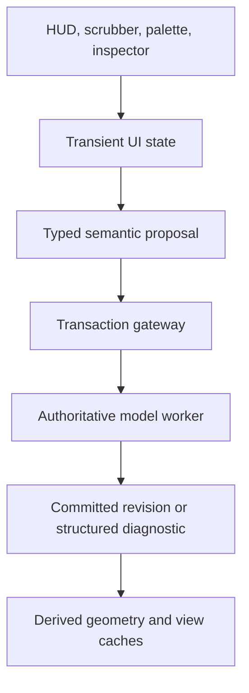

# ARQ UI/UX System Specification

## Interaction, accessibility, motion, and progressive surface rendering

> Status: implementation companion  
> Scope: UI presentation and input behaviour. This document supplements, and does not replace, the semantic model, transaction, selection, and deferred geometry contracts in the master specification and implementation deep dive.

Arq should feel immediate, composed, and trustworthy while staying precise under real architectural work. The goal is not to imitate a particular operating system. The goal is a platform-adaptive professional interface with low interaction friction, readable measurements, accessible controls, and a clear boundary between a provisional edit and a committed building-model change.

The supplied UI direction is strong: cursor-local controls, glass depth, visual diagnostics, inspect-through selection, proxy dragging, and option overlays all reduce the familiar friction of legacy CAD applications. This specification retains those outcomes while correcting implementation traps that would otherwise create invalid quantity commits, blocked canvas input, inaccessible commands, misleading motion, or unsafe quick fixes.

## 1. Decisions at a glance

| Desired experience                      | Required implementation rule                                                                                                                            |
| --------------------------------------- | ------------------------------------------------------------------------------------------------------------------------------------------------------- |
| Cursor-local editing                    | HUD placement is presentation-only; it never owns canonical geometry or catches canvas input outside an actual control.                                 |
| Type a dimension immediately            | Keep an editable draft string separate from the canonical quantity; commit only a valid, finite, domain-valid value.                                    |
| Drag a label to scrub a value           | Pointer movement creates transient previews. Pointer release creates at most one semantic proposal. Escape cancels.                                     |
| Command everything with Cmd+K or Ctrl+K | The palette opens and closes explicitly, uses accessible dialog/list semantics, and creates typed proposals rather than calling direct model mutations. |
| Non-blocking diagnostics                | A diagnostic chip may dismiss a presentation. Its quick fix is revision-guarded and goes through the normal transaction gateway.                        |
| Delicate glass surfaces                 | Use opaque, contrast-safe baseline surfaces. Blur, saturation, and squircle corners are progressive enhancements for small floating overlays.           |
| Responsive motion                       | Spring motion is opt-in and reduced-motion aware. Velocity tilt uses actual pointer velocity, is capped, and stops while an input is focused.           |
| Browse hidden objects                   | Default to one-layer semantic picking. The inspect-through stack remains an explicit, bounded action defined in the implementation deep dive.           |
| Compare design options                  | Render a named, revision-pinned option overlay. A ghost is not an unbounded or free CRDT branch.                                                        |

## 2. One interaction pipeline for every UI surface

HUDs, scrubbers, a property inspector, radial menus, keyboard shortcuts, and the command palette must reach the model through the same command boundary. This removes a common source of CAD inconsistency: one UI path validates a wall edit while another silently mutates it.



### 2.1 Three states, never one ambiguous state

| State                         | Owner        | Examples                                                   | Persistence                                                    |
| ----------------------------- | ------------ | ---------------------------------------------------------- | -------------------------------------------------------------- |
| Presentation state            | UI process   | Palette open, HUD position, selected diagnostic card       | Never persisted as BIM data                                    |
| Provisional interaction state | Tool session | Pointer preview, scrub draft, wall drag proxy              | May be replayed locally, but does not alter canonical document |
| Semantic state                | Model worker | Wall location, level constraint, opening host relationship | Transactional, revisioned, collaborative                       |

The following invariant applies everywhere:

> A motion frame may update a proxy. Only a validated transaction may update the canonical model.

That means a length HUD and a slider are not special shortcuts around validation. They both produce a typed command containing the base document revision, the targeted semantic property, the requested value, and sufficient context for the worker to validate it.

## 3. Recommended build order

Build the interaction primitives first, then compose them into visual components.

1. **Quantity draft and semantic-proposal bridge**. Finish safe parsing, units, range validation, previews, cancellation, and one undoable commit.
2. **Numeric scrub session**. Add pointer capture, keyboard equivalent controls, modifier precision, and transaction-on-release behaviour.
3. **Contextual HUD**. Add safe placement, focus freeze, viewport collision handling, and passive versus interactive hit areas.
4. **Accessible command palette**. Add searchable proposals, availability predicates, focus management, and keyboard contracts.
5. **Ambient diagnostics and quick fixes**. Add persistent diagnostic lifecycle and revision-guarded fixes.
6. **Surface, icon, and motion tokens**. Add progressive rendering, contrast and reduced-motion support.
7. **Depth-stack inspector and option ghosts**. Compose these with the existing selection and branch contracts after the fundamentals are proven.

This sequence produces professional input behaviour before visual polish makes an unsafe interaction appear finished.

## 4. Contextual HUD contract

### 4.1 Modes

The HUD has two distinct modes.

| Mode            | Pointer behaviour                                                                           | Focus behaviour                       | Model effect                      |
| --------------- | ------------------------------------------------------------------------------------------- | ------------------------------------- | --------------------------------- |
| Passive preview | Tracks nearby pointer with a small offset; decorative body does not intercept canvas events | No focus                              | None                              |
| Active edit     | Anchors beside the selected geometry or tool cursor; position freezes during text input     | Actual input or button receives focus | Validated proposal on commit only |

The panel body uses pointer-events none. Individual form controls and buttons opt into pointer events auto. This prevents an invisible or oversized HUD from consuming canvas pan, orbit, snapping, or context-menu gestures.

The placement utility in [reference/hud-placement.ts](reference/hud-placement.ts) tries four corners around the anchor, respects safe-area insets and protected rectangles, and clamps the result into the viewport. A protected rectangle can represent an open palette, an active text caret region, or a platform window control area.

### 4.2 Motion

Do not calculate tilt from absolute screen position. A panel at the right side of the viewport is not inherently moving right. Tilt, when it is appropriate, is calculated from current horizontal pointer velocity and capped at plus or minus 1.5 degrees.

Use two nested motion containers:

- An outer position container follows the spring-smoothed position.
- An inner surface container owns opacity, scale, and tilt entry/exit motion.

This avoids conflicting animations that both write the vertical coordinate. Disable position lag and tilt while a quantity field is focused, while the user has enabled reduced motion, and when a touch or keyboard interaction has no meaningful pointer velocity.

Suggested spring token for optional local overlays:

```ts
export const arqOverlaySpring = {
  type: 'spring' as const,
  stiffness: 420,
  damping: 30,
  mass: 0.7,
};
```

It is a token, not a mandate. Long-running camera, layout, and data-loading transitions need separate motion policy and must respect user preference.

### 4.3 Quantity input

The browser number input is not the canonical edit buffer. It often reports an empty string while the user is typing, and direct conversion can produce NaN. A controlled quantity component must:

1. Hold editable text in a draft object.
2. Parse against the active display unit.
3. Show an inline error for incomplete or invalid text without changing the semantic property.
4. Commit on Enter or explicit confirmation only after finite, range, and domain validation.
5. On Escape, restore the prior display value and return focus to the tool.
6. Freeze cursor-following motion while the field has focus.

Use [reference/quantity-draft.ts](reference/quantity-draft.ts) for length text parsing. The canonical quantity remains metres even when the UI displays millimetres, feet, or inches.

### 4.4 Inline scrubbing

An inline label can offer scrub behaviour, but text selection and precise keyboard entry remain equally available. The required pointer contract is:

| Event                            | UI action                                        | Semantic action                                       |
| -------------------------------- | ------------------------------------------------ | ----------------------------------------------------- |
| Pointer down on scrub affordance | Capture pointer; start NumericScrubSession       | None                                                  |
| Pointer move                     | Update visible preview and proxy geometry        | None                                                  |
| Pointer up                       | End session; compare preview to original         | Create one proposal only if changed                   |
| Escape or pointer cancel         | Restore original preview                         | None                                                  |
| Arrow keys / Page keys           | Adjust accessible form control in declared steps | Proposal according to standard quantity commit policy |

Shift may select fine precision and Alt or Option may select coarse precision, but the modifiers must be disclosed through tooltip, help, and keyboard alternatives. Capture only the dedicated scrub affordance, not the entire HUD.

[reference/numeric-scrubber.ts](reference/numeric-scrubber.ts) is a pure calculation contract for this session. It quantizes and clamps previews and refuses to continue after commit or cancel. The React layer owns pointer capture and uses its result to create the final command proposal.

## 5. Command palette and keyboard engine

The command palette is an application-level command surface, not a direct mutation API.

### 5.1 Opening, focus, and composition

- Cmd+K on macOS and Ctrl+K elsewhere opens the palette. The shortcut must actually call an open state transition when closed.
- Escape closes it and restores focus to the invoking element where possible.
- Do not hijack shortcuts from an active native text editor unless that editor explicitly delegates the shortcut.
- During IME composition, do not treat Enter as command activation.
- Commands must have an accessible name, category, availability reason when disabled, and keyboard-operable selection.
- Follow the WAI dialog and listbox or menu pattern selected by the implementation. Do not simulate clickable command rows with bare div elements.

The WAI-ARIA dialog pattern requires managed focus and a keyboard mechanism to close the dialog. A palette that blocks the application should be intentional and accessible, not merely a visual overlay. [WAI dialog pattern](https://www.w3.org/WAI/ARIA/apg/patterns/dialog-modal/)

### 5.2 Command descriptor

Every command receives current context and returns a proposal, or returns unavailable. It does not receive direct access to the canonical document object.

```ts
export interface CommandDescriptor<Context, Proposal> {
  readonly id: string;
  readonly title: string;
  readonly category: string;
  readonly aliases?: readonly string[];
  readonly isAvailable?: (context: Context) => boolean;
  readonly createProposal: (context: Context) => Proposal | undefined;
}
```

The command bridge submits the proposal to the model worker. The worker decides whether a selected wall is editable, a referenced level exists, the caller has permission, and the proposal still targets the active revision.

[reference/command-palette-state.ts](reference/command-palette-state.ts) supplies deterministic ranking and palette state. It intentionally has no callback that can write the model.

### 5.3 Search quality

Start with deterministic exact, prefix, substring, and subsequence ranking. Make title and identifier stable tie-breakers. Add semantic synonyms, recent commands, parameterized commands, and permission-aware results only after the base interaction has tests.

The palette should show a concise phrase such as "Set wall height" and defer the actual value entry to a focused quantity input or a parameter form. It should not parse arbitrary English as a safety-critical geometry command without a reviewable interpretation screen.

## 6. Ambient diagnostics and quick fixes

Non-modal diagnostics preserve flow. They do not mean that an invalid model is silently accepted.

### 6.1 Presentation rules

- Render a semantic marker on the affected geometry and provide the same message in text.
- Use icon, label, and colour together. Never make colour the only indication of severity.
- Keep a persistent diagnostic discoverable in the inspector, diagnostics panel, and exported review report even if its chip is dismissed.
- Reserve interruptive alerts for exceptional cases that require immediate attention. Routine rules use polite status messaging and a navigable diagnostics list.
- Auto-dismiss only low-risk transient confirmations. Do not auto-dismiss unresolved compliance or geometry diagnostics.

The WAI alert pattern is intentionally assertive and should be used sparingly. [WAI alert pattern](https://www.w3.org/WAI/ARIA/apg/patterns/alert/)

### 6.2 Quick-fix policy

A quick fix must be represented as a normal typed command proposal:

1. The diagnostic records the document revision that produced it.
2. Clicking the fix verifies that the active revision is still the source revision.
3. The UI asks the standard transaction gateway to validate and apply the proposed command.
4. A stale result requests re-evaluation rather than applying an old suggested mutation.

[reference/diagnostic-actions.ts](reference/diagnostic-actions.ts) encodes that boundary. Dismissing a chip only suppresses the presentation instance. It does not mark the rule as resolved.

## 7. Surface system, typography, and icons

### 7.1 Glass is a bounded enhancement

Translucent panels work particularly well for a small HUD, command palette, layer chooser, or diagnostic chip. They are inappropriate for large persistent regions over a continuously rendered 3D canvas unless measured on target devices. Backdrop filtering incurs rendering work behind the panel, and a fall-back opaque surface must remain usable. [MDN backdrop-filter](https://developer.mozilla.org/en-US/docs/Web/CSS/Reference/Properties/backdrop-filter)

The baseline surface has enough opacity, border contrast, and readable shadow without blur. The supplied design token implementation has been corrected and is available at [reference/arq-ui-theme.css](reference/arq-ui-theme.css).

### 7.2 Corners and hairlines

Use a normal border radius as the baseline. The proposed CSS property named corner-smoothing is not a dependable web platform primitive. CSS corner-shape can express squircle-like corners but is experimental and has limited browser availability, so it may be used only behind an at-supports rule with border-radius fallback. [MDN corner-shape](https://developer.mozilla.org/en-US/docs/Web/CSS/Reference/Properties/corner-shape)

Use a one-pixel alpha border as the cross-device baseline. A half-pixel border can look sharp on some high-density displays and weak on standard-density panels. Any device-pixel ratio refinement must be visually tested at 1x, 2x, and 3x.

### 7.3 Typography

| Content                                    | Font policy                                                                    | Numeric policy                              |
| ------------------------------------------ | ------------------------------------------------------------------------------ | ------------------------------------------- |
| Application controls                       | System UI font stack with platform fallbacks                                   | Proportional unless value alignment matters |
| Coordinates, dimensions, angles, schedules | System-compatible monospace or tabular-capable stack                           | tabular-nums and lining-nums                |
| Large titles                               | Optical review with slightly negative tracking if necessary                    | No special requirement                      |
| Micro labels                               | Avoid overly tight space; use modest positive tracking and non-colour contrast | Do not use for essential content only       |

Tabular digits make changing measurements less visually jittery when the selected font supports them. They do not replace stable container widths, clear labels, or correct quantity validation. Avoid presenting non-standard font smoothing settings as a universal visual guarantee.

### 7.4 Icons

Create a small source icon set on a 24 by 24 grid with a 2-pixel safety area. Use rounded joins and caps only where the glyph design calls for them. Recommended stroke weights are a starting visual test, not a rule of nature:

| Visual size | Starting stroke test |
| ----------- | -------------------- |
| 16 pixels   | 1.5 pixels           |
| 20 pixels   | 1.75 pixels          |
| 24 pixels   | 2 pixels             |

Every icon-only control needs an accessible name and a hit target sized for the supported input modes. Test the glyphs at device pixel ratios 1, 2, and 3, in high contrast, and with selected, disabled, hover, focus, and pressed states.

## 8. Ghost options and inspect-through selection

### 8.1 Spatial options

An option overlay must show:

- the branch or option name,
- its frozen source revision,
- the active option or document revision,
- whether it is read-only, stale, or diverged,
- its visual distinction without relying only on colour.

The term zero-cost is unsuitable for product guarantees. Snapshotting, storage, derived geometry, and comparison rendering all have cost. The user outcome is rapid, explicit, side-by-side or overlaid comparison, not a promise of free branching.

### 8.2 Selection depth

Hover can show semantic target context such as wall, curtain panel, structural stud, or duct. It must not perform an expensive unbounded global depth-peeling operation on every pointer move. One-layer GPU ID picking is the default. An inspect-through command may request a capped depth stack, with cursor scissor, revision-matched draw-ID mapping, and a keyboard-accessible target list. See [ARQ_IMPLEMENTATION_DEEP_DIVE.md](ARQ_IMPLEMENTATION_DEEP_DIVE.md).

## 9. Acceptance and accessibility gates

The UI is ready for the first production feature only when all applicable checks pass.

| Area               | Minimum gate                                                                                                                                               |
| ------------------ | ---------------------------------------------------------------------------------------------------------------------------------------------------------- |
| Canvas interaction | Passive HUD regions do not block pan, orbit, selection, or context menu.                                                                                   |
| Quantity entry     | Empty, incomplete, invalid, non-finite, and out-of-range values cannot commit. Escape restores the original value.                                         |
| Scrubbing          | Pointer capture ends on up, cancel, and lost capture. A drag produces at most one undoable command.                                                        |
| HUD placement      | Panel remains in safe viewport area, avoids active overlays where possible, and stops motion while editing.                                                |
| Command palette    | Opens from its shortcut, preserves and restores focus, supports keyboard navigation, honors IME composition, and produces proposals rather than mutations. |
| Diagnostics        | Persistent issue remains discoverable after dismissal. Quick fix fails safely when stale. No colour-only meaning.                                          |
| Motion             | Reduced-motion preference removes nonessential spring, tilt, and animated attention signals.                                                               |
| Visual contrast    | Opaque fallback is legible without backdrop blur. High-contrast and forced-colors modes remain usable.                                                     |
| Iconography        | Icon-only controls have names and adequate hit areas. Glyphs are reviewed at 1x, 2x, and 3x.                                                               |
| Performance        | HUD and palette overlays are profiled over an active 3D canvas; large blur layers are not assumed free.                                                    |

## 10. Reference index

| Reference                                                                | Purpose                                                                       |
| ------------------------------------------------------------------------ | ----------------------------------------------------------------------------- |
| [reference/quantity-draft.ts](reference/quantity-draft.ts)               | Controlled text-to-length parsing and valid commit boundary                   |
| [reference/numeric-scrubber.ts](reference/numeric-scrubber.ts)           | Pointer-independent numeric preview, quantization, commit, and cancel session |
| [reference/hud-placement.ts](reference/hud-placement.ts)                 | Safe corner placement and capped velocity tilt                                |
| [reference/command-palette-state.ts](reference/command-palette-state.ts) | Deterministic search state that returns proposals only                        |
| [reference/diagnostic-actions.ts](reference/diagnostic-actions.ts)       | Persistent diagnostic presentation and revision-guarded quick-fix contract    |
| [reference/arq-ui-theme.css](reference/arq-ui-theme.css)                 | Progressive surface, typography, contrast, and reduced-motion tokens          |
| [ARQ_IMPLEMENTATION_DEEP_DIVE.md](ARQ_IMPLEMENTATION_DEEP_DIVE.md)       | GPU selection, deferred CSG, desktop boundary, and implementation corrections |

## 11. Source notes

- [WAI-ARIA dialog pattern](https://www.w3.org/WAI/ARIA/apg/patterns/dialog-modal/)
- [WAI-ARIA alert pattern](https://www.w3.org/WAI/ARIA/apg/patterns/alert/)
- [MDN: backdrop-filter](https://developer.mozilla.org/en-US/docs/Web/CSS/Reference/Properties/backdrop-filter)
- [MDN: corner-shape](https://developer.mozilla.org/en-US/docs/Web/CSS/Reference/Properties/corner-shape)
