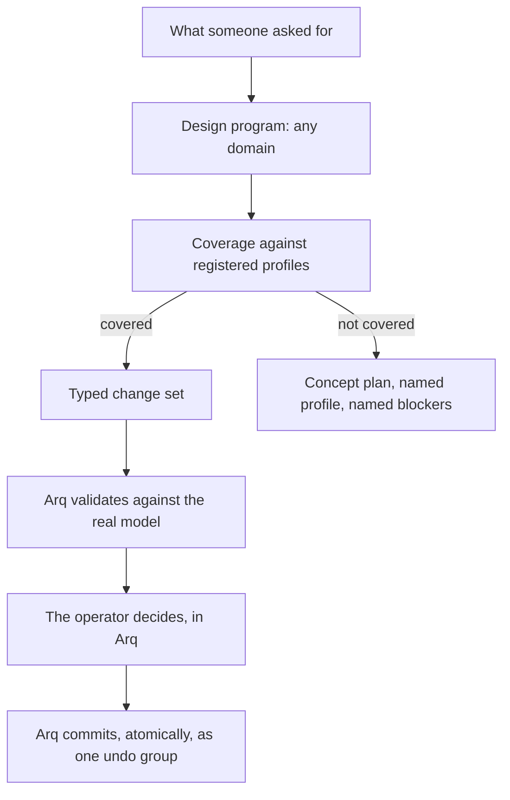

# @arq/mcp-server

The governed boundary between an AI client and an Arq project.

An assistant connected here can read a shared project, write plans, and propose
typed changes. It cannot commit a change, approve one, name a file path, write a
file, or run a query language. Those are not policies it is asked to respect;
there is no tool for any of them, and the object that can commit is never passed
to the server.

Decided in [ADR-0027](../../docs/adr/0027-mcp-boundary-and-domain-profiles.md).
The critique of the reference packages this replaces, and the full defect
register, is in [docs/ai/MCP-SYSTEM-3.0-PLAN.md](../../docs/ai/MCP-SYSTEM-3.0-PLAN.md).

## The four steps



Steps one and two accept any design domain. Steps four onwards accept only what
a registered domain profile publishes. The gap between them is where the honest
answer lives: an unregistered domain returns the profile that would own the
work, the operations it would need, and the specific blockers - a reviewable
backlog rather than a refusal or a fabrication.

## What is wired to what

| This package                                | Uses                                                                                           |
| ------------------------------------------- | ---------------------------------------------------------------------------------------------- |
| Operation types in the architecture profile | `@arq/arqscript` constructors, read at module load (ADR-0014)                                  |
| The semantic model the host applies to      | `@arq/bim-core` levels, wall types, walls, openings, rooms, dimensions                         |
| Validation                                  | `@arq/validation` segment, polygon and identity rules; `@arq/operations` opening-overlap rules |
| Derived-output names                        | `@arq/bim-core`'s own invalidation constants                                                   |

Nothing here restates a rule that lives in one of those packages.

## Wiring it up

```ts
import {
  createArqMcpRuntime,
  createMemoryArqHost,
  createGrant,
  GRANT_PRESETS,
} from '@arq/mcp-server';

// The Arq application supplies the host. `createMemoryArqHost` is the
// in-process one; a live application implements `ArqProjectHost` over its own
// project context and keeps `ArqOperatorSurface` to itself.
const { host, operator } = createMemoryArqHost();

const runtime = createArqMcpRuntime({
  host,
  // Called on every tool call, so a grant the operator withdraws stops working
  // on the next call rather than at the next reconnection. Returning undefined
  // means nothing is shared, which is what an unwired application gets.
  resolveGrant: (client) => grantsFor(client),
});

serveStdio({ server: runtime.server });
```

There is no default grant. An application that forgets `resolveGrant` gets a
server whose every tool answers "nothing is shared with this connection".

## The tool surface

| Group          | Tools                                                                                                                                                                                                                        |
| -------------- | ---------------------------------------------------------------------------------------------------------------------------------------------------------------------------------------------------------------------------- |
| Discovery      | `arq_get_capabilities`, `arq_list_domain_profiles`, `arq_get_domain_profile`                                                                                                                                                 |
| Reading        | `arq_list_projects`, `arq_get_project_snapshot`, `arq_query_model`, `arq_get_operation_catalog`                                                                                                                              |
| Planning       | `arq_save_brief`, `arq_get_brief`, `arq_list_briefs`, `arq_save_design_program`, `arq_get_design_program`, `arq_list_design_programs`, `arq_assess_design_program_coverage`                                                  |
| Requests       | `arq_create_project_draft`, `arq_request_project_open`, `arq_stage_changeset`, `arq_get_changeset`, `arq_list_changesets`, `arq_request_changeset_review`, `arq_cancel_changeset`, `arq_request_undo`, `arq_request_publish` |
| Accountability | `arq_get_audit_trail`                                                                                                                                                                                                        |

Every result carries `canonicalMutation`, which is `none` on everything this
server can produce and `committed_by_arq` only when reading back a proposal Arq
itself committed. It is the field that decides whether an assistant may say a
project changed.

## Guarantees, and how they are held

| Guarantee                                                                     | How                                                                                         |
| ----------------------------------------------------------------------------- | ------------------------------------------------------------------------------------------- |
| No tool commits or approves                                                   | The commit methods live on `ArqOperatorSurface`, which the server is never constructed with |
| A rejected proposal changes nothing                                           | `validate` and `apply` run the same batch code over a clone; only success swaps it in       |
| A project outside the grant is indistinguishable from one that does not exist | One non-disclosing error factory, asserted byte-identical in tests                          |
| Advertised limits equal enforced limits                                       | One constant table consumed by both the schemas and the capability report                   |
| A tool's schema matches what it checks                                        | One `Validator` carries both; drift is unrepresentable                                      |
| Nothing is fetched                                                            | There is no fetch. A reference URI is parsed, stored and read by a person                   |

## Running it

```bash
pnpm --filter @arq/mcp-server build     # -> dist/arq-mcp-stdio.mjs
ARQ_MCP_SEED_PROJECT='My project' \
  ARQ_MCP_GRANT_FILE=/path/to/grant.json \
  node packages/mcp-server/dist/arq-mcp-stdio.mjs
```

Unlike every other package here, this one builds. An MCP client launches a
process and speaks to it over stdio; it cannot import TypeScript source, and
Node's own type stripping does not help because the workspace packages use
extensionless relative imports. The build is a single bundled Node module
with no resolution setup.

Access comes from the grant file and nowhere else. With no file, every tool
answers that nothing is shared. Deleting it withdraws access on the next
call, without a reconnection. See [config/README.md](config/README.md).

## Running the checks

```bash
pnpm --filter @arq/mcp-server typecheck
pnpm vitest run packages/mcp-server     # 260 in-process tests
pnpm benchmark:mcp-protocol             # spawns the built server, real stdio
```

The last one is the half the unit tests cannot cover: it launches the bundle
as a process and asserts, over real JSON-RPC, that the handshake negotiates,
that an ungranted connection is told so, that a staged proposal reports
`canonicalMutation: none`, that an unbuildable domain names its profile and
blockers, that deleting the grant file mid-session withdraws access
immediately, and that standard output carried protocol and nothing else. It
writes timestamped evidence to `benchmarks/results/`.

## What this is not

It is not the `.arq` file. STATUS.md records that no end-to-end project open
exists yet, so the host holds the semantic model in memory and publication stays
a request the operator completes in Arq by choosing a destination.

It is not a rendered panel. `review/review-centre.ts` is the state, copy and
action-gating model the Assistant panel needs; no React surface consumes it yet.

It is not evidence that any client has been tested. The configuration templates
in [`config/`](config) are starting points, and support is claimed per client
after a recorded run, never inferred from another client.
